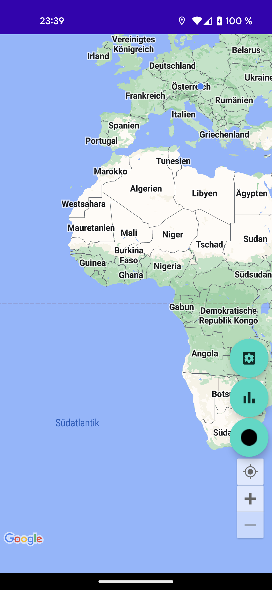
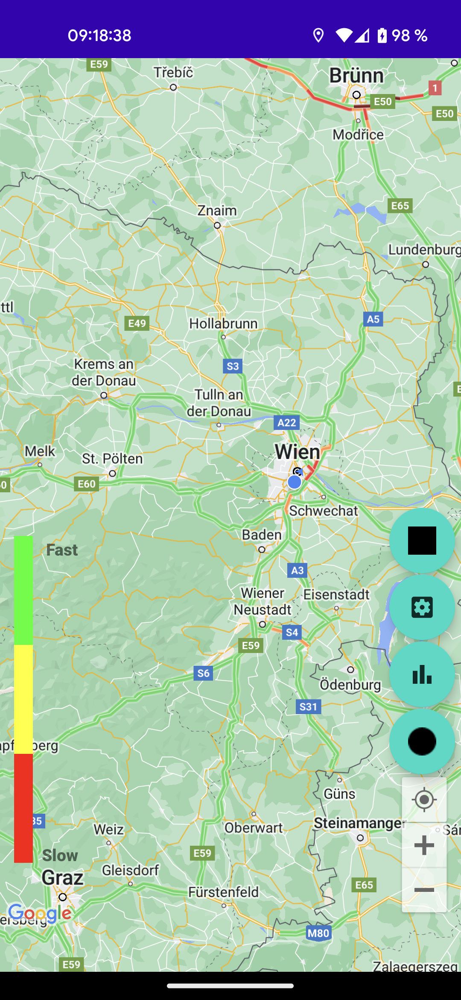
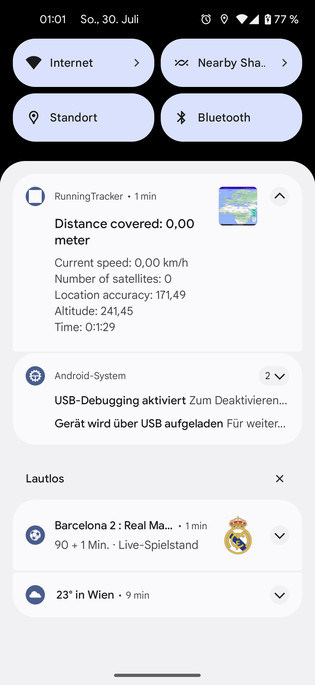
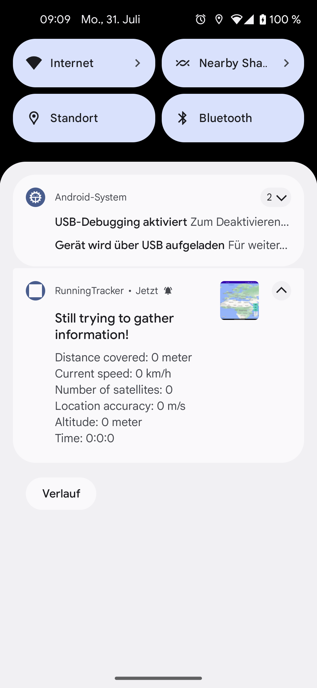
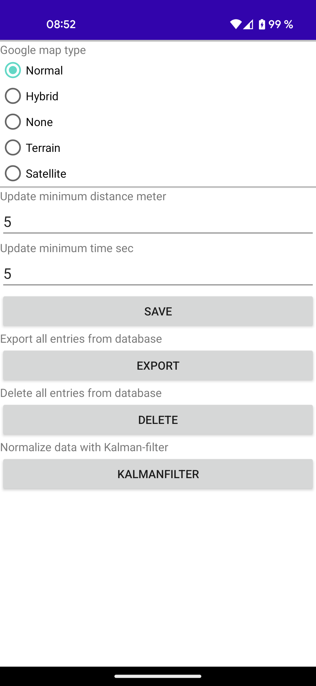
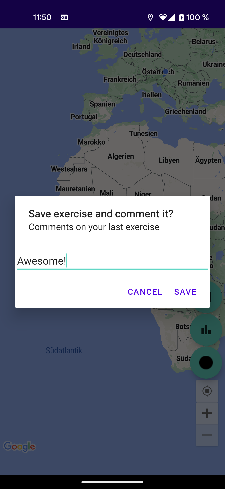
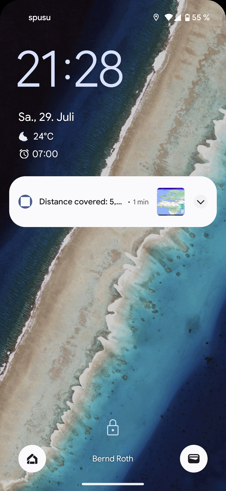
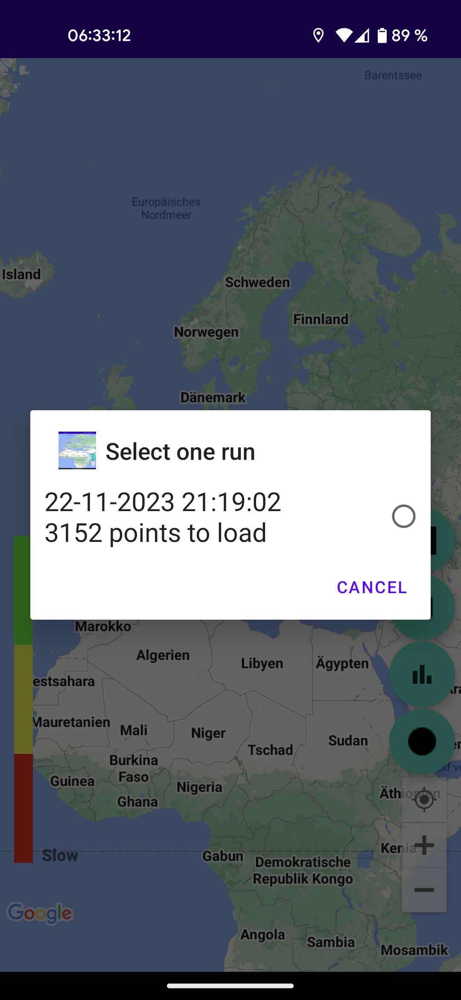
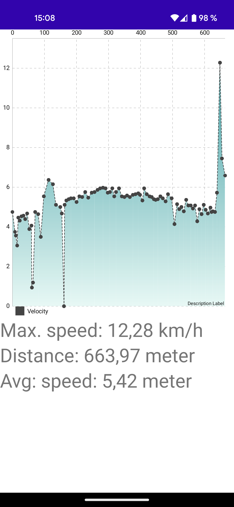

# Ultrarunning

Ultrarunning is a Java program for tracking your marathons and ultramarathons.

## Installation

Download the project and build it in Android Studio.

## Usage

Start the app and that`s it.

## Pics

## Contributing

Pull requests are welcome. For major changes, please open an issue first
to discuss what you would like to change.

Please make sure to update tests as appropriate.

## License

[MIT](https://choosealicense.com/licenses/mit/)